# VisBLE: BLE Tag Identification with Vision Enhacement

The industrially available solutions for local tracking of BLE tags become unreliable when there are more than one tags. This work proposes a novel mechanism that could allow a mobile phone to visualize the tags coming in its field of view on screen. During our work we assume that there are morethan one antenna is available in mobile phone expecting that is the case in future. The work focuses in combining wirless signal positioning technology and visual enhancement technology to realize tag localization. With the help of valuable addition of AoA into BLE 5.2 we get the angle of arrival data stamped with level meter angle with the help of sensors available in mobile phone. Then we convert the obtained the angle information into point cloud information in the camera coordinate system, which can eliminate measurementwise errors since we are directly rely on ratios. The conference paper could be downloaded [here](./conference_paper.pdf)
## System Overview
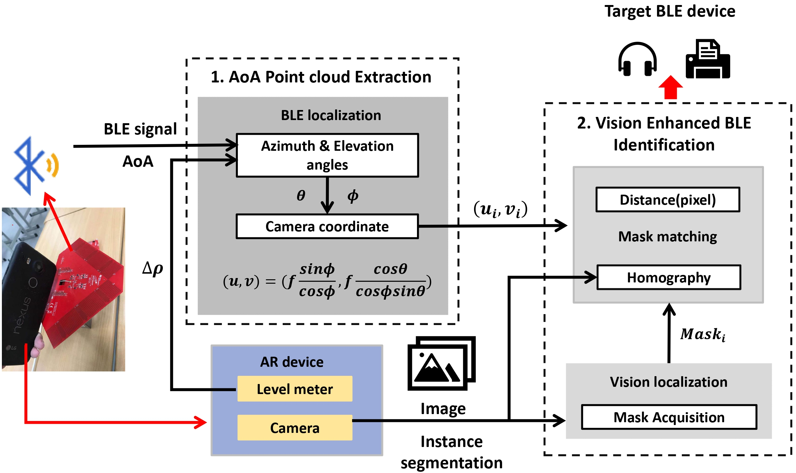
## 1. AoA Point Cloud Extraction
### Task
Forming cloud of points corresponding to each BLE device lies in the FOV. We need to calculate the angle of arrival for signals departing from each devices related to the camera center. Due to the physical interferances, the AoA spread will be reflected in a cloud of points for the destination.
### Calculation
Consider a case where the user rotates the adroid device along the Y-axis. 
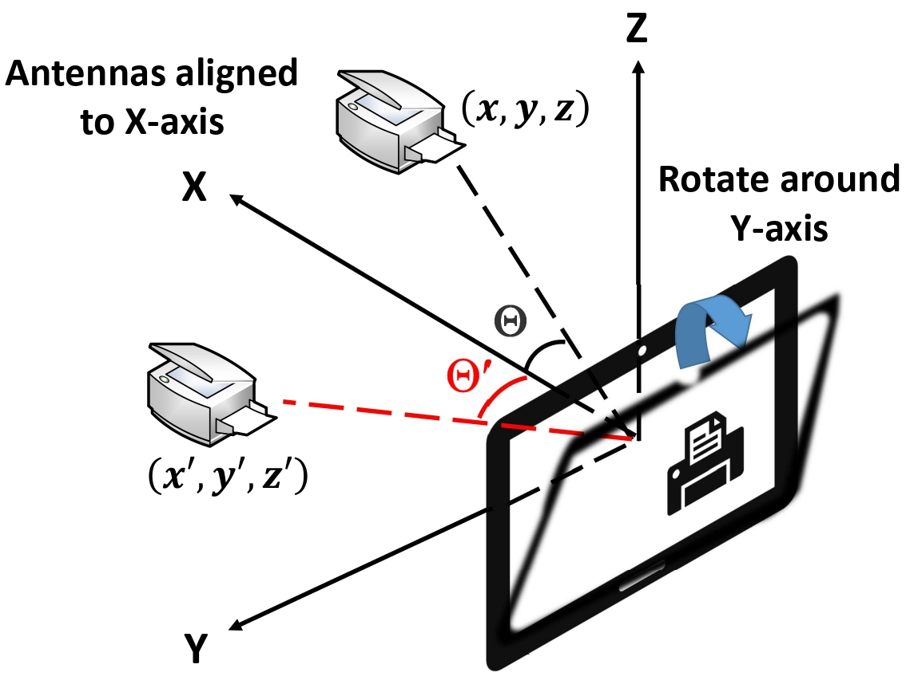

$$z=OMcos{\alpha\qquad x=OMsin{\alpha}}$$
$$z^\prime=OM^\prime cos{(\Delta\rho+\alpha)\qquad x^\prime=OM^\prime sin{(\Delta\rho+\alpha)}}$$
where $\Delta\rho$ represents the angle at which the user rotates the device around Y-axis and $\alpha$ represents the angle between $M$ and Z-axis.  Also, $OM = OM^\prime$ and Y-axis co-ordinate remains unchanged, since the rotation is around the Y-axis. $$y=y^\prime$$ 

Based on this observation, the relation is as follows:
$$\left[\begin{matrix}x^\prime\\y^\prime\\z^\prime\\\end{matrix}\right]=\ \left[\begin{matrix}cos{\Delta\rho}&0&sin{\Delta\rho}\\0&1&0\\-sin{\Delta\rho}&0&cos{\Delta\rho}\\ \end{matrix}\right]\left[\begin{matrix}x\\y\\z\\\end{matrix}\right]$$
From the equations we can derive elevation and azimuth angles as follows,
$$\theta = arccos{\frac{cos{(\Theta^\prime)}-cos{(\Delta\rho)}cos{(\Theta)}}{sin{(\Delta\rho)}}}$$
  $$\phi = arccos{\frac{cos{(\Theta)}}{sin{(\theta)}}}$$
Once the elevation and azimuth angle is known we can derive the co-ordinates of device in camera co-ordinate system using linear model.
$$\left(u,v\right)=\left(f\frac{sin\phi}{cos\phi},f\frac{cos\theta}{cos\phi s i n\theta}\right)\qquad\text{;where f - focal length of camera in android device}$$

### Hadware Requirements
| LAUNCHXL-CC2640R2                                          | BOOSTXL-AOA                                                          | Android Mobile                   |
| ------------------------------------------------------------ | -------------------------------------------------------------------- | ------------------------------------------------------------------------- |
| 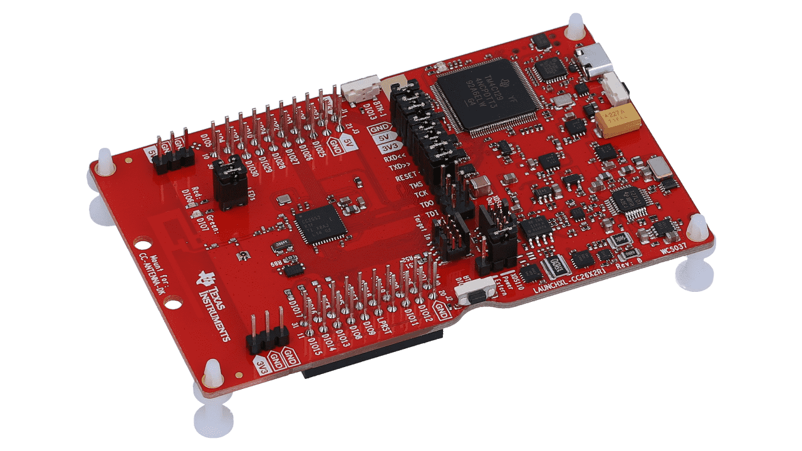 | 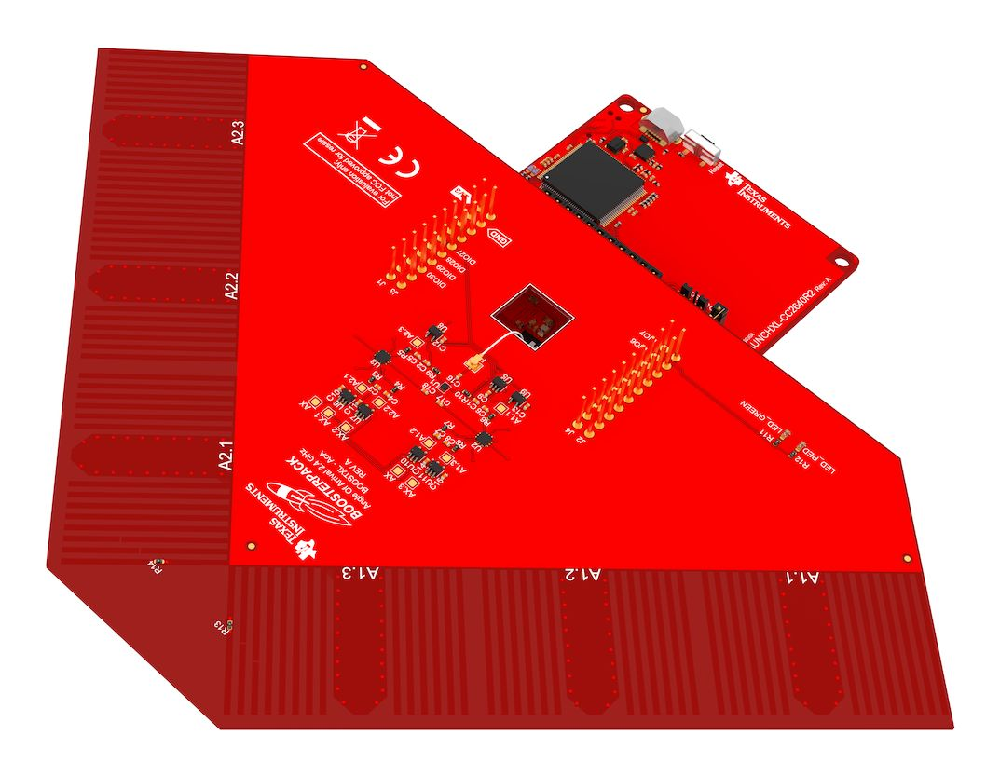| 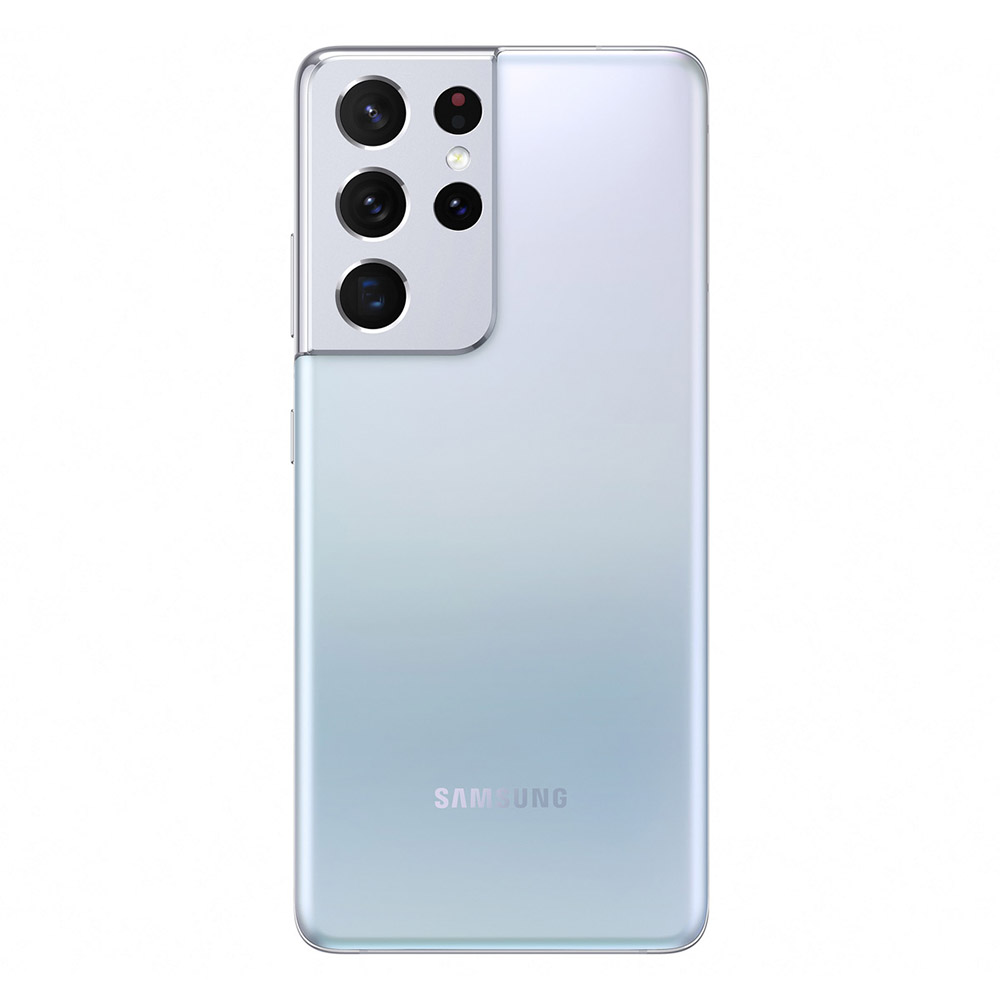 |

### Setup
Please refer to the following links on implementation details of AoA calculation via Ti Simplelink Platform 
1. [Bluetooth Low Energy: Ti Simplelink AoA Calculation Guide](https://dev.ti.com/tirex/content/simplelink_academy_cc13x2_26x2sdk_5_10_00_00/modules/rtls_toolbox_ble5/ble_aoa/ble_aoa.html)
2. [SDK Different Versions](https://e2e.ti.com/support/tools/code-composer-studio-group/ccs/f/code-composer-studio-forum/803711/ccs-old-version-of-simplelink-sdk-not-showing-in-resource-explorer-after-manual-installation)
3. [Simplelink : RTLS Tool box](https://dev.ti.com/tirex/content/simplelink_cc13x2_26x2_sdk_5_10_00_48/docs/ble5stack/ble_user_guide/html/ble-stack-5.x-guide/localization-index-cc13x2_26x2.html)
4. [CC26X2 Launchpad official website](https://www.ti.com/product/LAUNCHXL-CC26X2R1/part-details/LAUNCHXL-CC26X2R1?ds_k=LAUNCHXL-CC26X2R1&DCM=yes)

Once you are ready with the AoA calculation setup,align the center of the antenna board with the center of camera. Since it is impossible for us to align perfectly the centers, it is recommended to use one of the following configuration and compensate the effect of mismatch with proper calibration. Only three antennas are required to make the interested reading left us with the second choice for better results.  
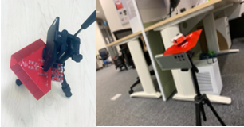

### Implementation
* Files related to mobile application that is used to find the device rotation angles could be found in the [level](./level/) folder. The app is adapted to allow measurment over all three axis of rotation based on future expectation.
* Python implementation of AoA extraction using Ti Simplelink platform could be found [here](./codes/lib/rtls_slave.py). The implementation allows collection of AoA data from multiple slaves parallely in the connected mode. (Expection is upto eight). This file also contains data filtering implementation. This file also contains the mathematical calculation details of the point cloud from AoA data.
* Python code for a Flask server that is used to collect level meter data from android device that is corresponding to each AoA data could be found [here](./codes/data.ipynb).

## 2. Homography Based Matching
### Task
Matching the point clouds with masks derived from image segmentation

### Method
1. Create two instances of the experiment by rotating the mobile along Y-axis. Derive AoA point clouds corresponding to each instace seperately.
2. Mask out the images using the Mask RCNN model. You can find the details of setting up the mask RCNN model [here](https://github.com/matterport/Mask_RCNN).
3. Match the derived masks using SIFT or any other feature matching technique and derive the corresponding homography transformation.
4. Form a convex hull using the point cloud and match the image regions lie under the hull in both the images. Based on the matched region calculate the relevant homography transformation.
5. By matching the homography matrices closely find the best mask that matches the point cloud. (This is valid because homography matrix is unique for a plane)

### Implementation
You can find the implementation of the above idea [here](./codes/mask_visualize.ipynb)

## Experimental Results
### Point Cloud Performance
1. Android device is rotated in a constrained Environment (Tripod)  
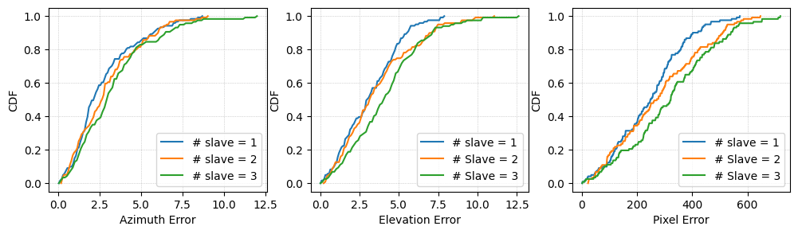
2. Android device is rotated with the help of User Interface
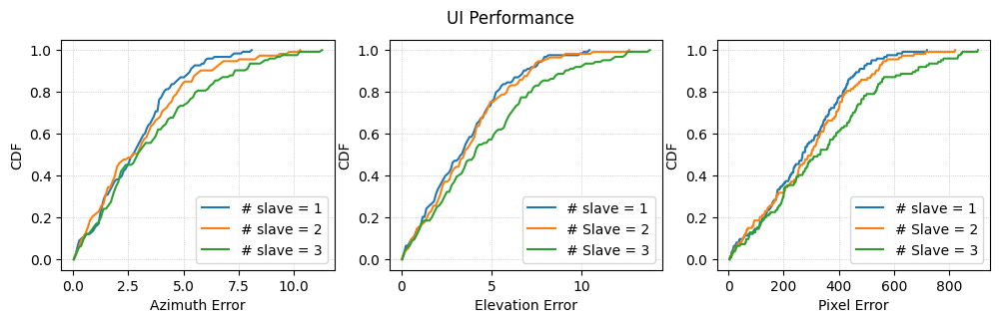 
***Comparision*** 
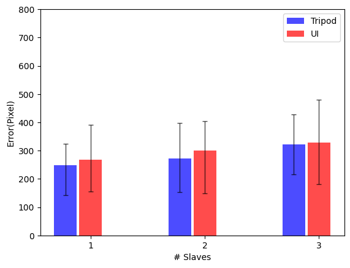 
#### Effect of Data Acquistion Time on Performance
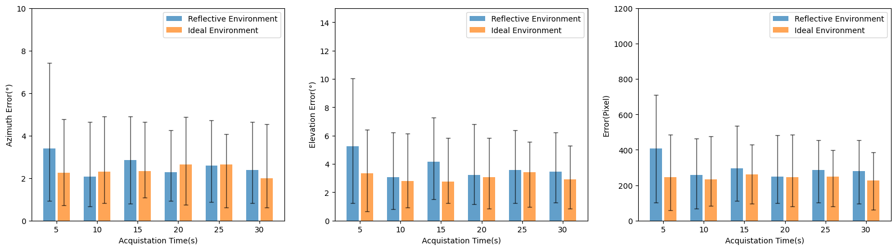 
#### Effect of Distance on Performance
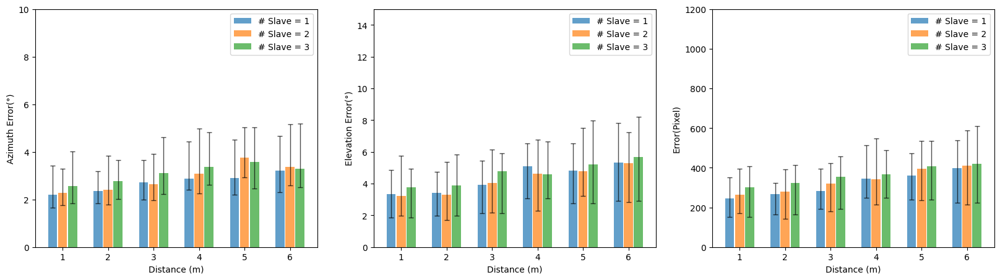 